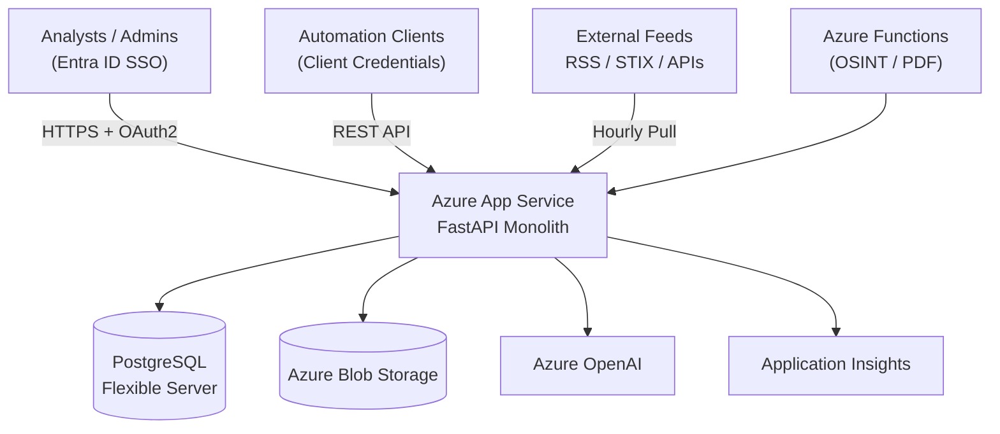

# API-First Threat Intelligence & OSINT Platform Architecture

This document summarizes the minimal-cost Azure architecture that supports the FastAPI service contained in this repository. The focus is on keeping the monthly bill as low as practical while satisfying the MVP requirements: hourly feed ingestion, enrichment, AI-assisted newsletter drafting, Microsoft Entra ID SSO, and short-term data retention.

## 1. Deployment Overview

| Layer | Azure Service | Notes |
| --- | --- | --- |
| Web/API + background jobs | **Azure App Service (Linux, B1)** | Hosts the FastAPI app, REST API, and APScheduler-driven background jobs (ingestion, retention, newsletter drafting). Always On enabled so schedulers continue to run. |
| Database | **Azure Database for PostgreSQL Flexible Server (B1ms)** | Stores feeds, intel items, enrichment metadata, newsletters, audit records. Auto-backups retained 7 days. Single-zone deployment to minimise cost. |
| Object storage | **Azure Storage Account (Hot tier)** | Holds generated PDFs, optional raw feed snapshots, and ATT&CK/CVE reference datasets. |
| AI services | **Azure OpenAI (GPT-4 Turbo / GPT-4.1 Mini)** | Invoked on demand to draft newsletter sections or extract MITRE/CVE context. Requests routed through the App Service. |
| Optional burst workers | **Azure Functions (Consumption)** | Used only if heavier OSINT scraping or PDF rendering needs to be isolated; default deployment can rely solely on the App Service. |
| Monitoring | **Azure Monitor / Application Insights** | Collects application logs, feed metrics, audit trails. Sampling keeps usage inside the free tier when possible. |

The entire stack runs inside a single resource group. Networking relies on HTTPS with managed certificates; private endpoints can be added later if required.

## 2. Application Topology

Within the App Service the FastAPI application starts an APScheduler instance during startup. Scheduler jobs handle:

- Hourly feed ingestion and enrichment.
- Nightly retention pruning (default 31 days).
- Optional weekly AI newsletter draft generation.

Because everything executes within one container, deployment is simplified and cost remains low.

## 3. Data Model & API Summary

The persisted schema mirrors the Pydantic models in `app/schemas/`:

- `Feed` captures source metadata, schedule, and health.
- `IntelItem`, `Indicator`, and `IntelSource` store normalized intelligence and provenance.
- `NewsletterIssue`, `NewsletterVersion`, and `NewsletterIntel` record newsletter drafts, versions, and curated intel references.
- `UserProfile` maintains role assignments aligned with Entra ID groups or app roles.
- `AuditEvent` (future enhancement) records high-value actions.

API design principles:

- Versioned under `/api/v1` and documented via FastAPI’s OpenAPI schema.
- Pagination envelope (`PaginatedResponse`) for list endpoints.
- Role-based access enforced by dependencies in `app/core/security.py`.
- Integration clients receive read-only scopes for intel and feed endpoints.

## 4. Ingestion & Enrichment Pipeline

1. **Feed Polling** – APScheduler triggers hourly jobs that loop through configured feeds. Parsers use open-source libraries:
   - RSS/Atom via `feedparser`.
   - STIX/TAXII via `taxii2-client` and `stix2`.
   - JSON APIs via `httpx` adapters defined per feed type.
   - Scraper feeds (if any) can be executed inside the App Service with `httpx` + `BeautifulSoup` or dispatched to a Function when JavaScript rendering is required.

2. **Deduplication & Merge** – Items are fingerprinted (title + canonical URL + CVE/IOC sets). Matching items update source lists instead of creating duplicates.

3. **Enrichment** – After persistence, background tasks enrich:
   - MITRE ATT&CK tags from a cached ATT&CK dataset stored in Blob Storage.
   - CVE metadata pulled on-demand from the NVD API and cached locally.
   - IOC reputation via AbuseIPDB or AlienVault OTX with response caching.
   - Relevance tagging based on an organization-defined tech stack registry.

4. **Health Metrics** – Each ingestion run records last status, latency, and items fetched for exposure through admin APIs and Application Insights.

## 5. OSINT Microservices (Optional)

For company-specific OSINT the MVP reuses the monolith when tasks are lightweight (e.g., news RSS). When more advanced scraping or asynchronous workflows are needed:

- Deploy a single Azure Function (Python) on the Consumption plan.
- Trigger via HTTP or Service Bus queue posted by the main app.
- Store results in Blob Storage or directly post to the API for normalization.
- Keep execution capped (timeouts, concurrency) to stay inside free grants.

## 6. AI-Assisted Newsletter Workflow

- Analysts select relevant intel via the API/UI.
- A background job compiles item summaries and context into a prompt for Azure OpenAI.
- GPT returns section drafts stored as new `NewsletterVersion` rows.
- Analysts edit content in-app; all saves create versions for traceability.
- Final content is rendered to PDF with WeasyPrint (inside App Service) and stored in Blob Storage.
- An audit entry notes the publication event and file location.

Prompts instruct GPT to reference only supplied intel summaries, preventing hallucination. Token budgets are capped (<15k tokens per issue) to control cost.

## 7. Security & Governance

- **Authentication** – Microsoft Entra ID using Authorization Code flow (interactive users) and Client Credentials (integrations). JWT roles (`admin`, `analyst`, `integration`) map to `UserRole`.
- **Authorization** – `require_roles` dependency enforces RBAC per endpoint.
- **Secrets** – Stored in App Service configuration with references to Azure Key Vault when available.
- **Transport Security** – HTTPS enforced; all outbound calls (feeds, APIs) use TLS.
- **Data Protection** – PostgreSQL encryption at rest, Blob Storage SSE enabled, data retention job prunes intel after 31 days.
- **Audit Logging** – Important actions (feed changes, newsletter publish) logged to Application Insights and optionally persisted in an `audit_events` table.

## 8. Cost Estimate (Monthly)

| Service | SKU | Est. Cost |
| --- | --- | --- |
| Azure App Service | Linux B1 | **$13** |
| Azure Database for PostgreSQL | B1ms (1 vCore, 32 GB storage) | **$18** |
| Azure Storage Account | Hot tier, <50 GB | **$1** |
| Azure OpenAI | GPT-4 Turbo usage (~80k tokens) | **$6** |
| Application Insights | Basic with sampling | **$5** |
| Azure Functions (optional) | Consumption (low usage) | **$0–2** |
| **Total** |  | **≈ $43–45 / month** |

Scaling knobs:

- Pause optional Function apps when unused.
- Reduce newsletter drafting cadence or switch to GPT-4.1 Mini for lighter summaries.
- Auto-stop retention after 14 days if storage pressure increases.
- Scale up App Service or DB only when CPU/IO metrics indicate sustained saturation.

## 9. Build vs Buy Snapshot

| Option | Pros | Cons |
| --- | --- | --- |
| **MISP** | Mature IOC platform, many enrichment modules, easy STIX export. | Heavier UI, lacks AI/newsletter workflow, requires VM maintenance. |
| **OpenCTI** | Rich STIX-native graph analysis, strong ATT&CK modeling. | Requires Elastic/RabbitMQ stack, higher cost, overkill for MVP. |
| **Custom (this repo)** | Tailored workflow, minimal infrastructure, seamless AI integration, API-first. | Requires ongoing maintenance and incremental enrichment development. |

Given cost and feature fit, the custom FastAPI monolith is the recommended starting point, with interoperability ensured via planned STIX/CSV export endpoints.
