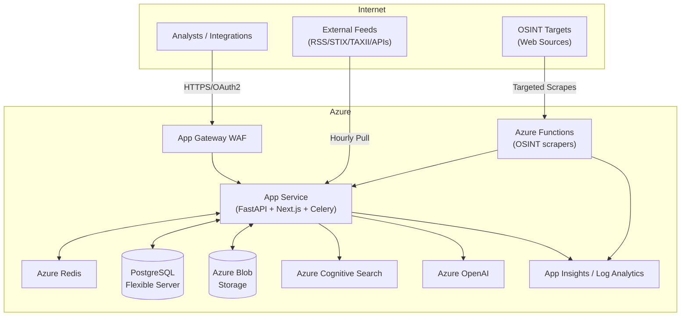

# API-First Threat Intelligence & OSINT Platform Architecture

## 1. Architectural Overview
- **Deployment Model:** Azure App Service (Linux) hosting a FastAPI backend and React/Next.js frontend as a monolith.
- **Compute Tier:** Single B1 App Service plan for MVP; scale up/out knobs documented.
- **Background Processing:** Azure Container Apps jobs or App Service WebJobs for scheduled ingestion; Azure Functions reserved for bursty scrapers.
- **Storage:** Azure PostgreSQL Flexible Server (Burstable B1ms) with 32 GB storage, short retention (~30 days) and partitioning by ingestion date.
- **Caching:** Azure Cache for Redis Basic C0 for token/session caching and rate limiting.
- **Search/Analytics:** Azure Cognitive Search free tier for full-text across intel items.
- **Object Storage:** Azure Storage Account (Hot tier) for raw feed dumps, enrichment artifacts, and generated PDFs.
- **AI Integration:** Azure OpenAI GPT-4 Turbo for summarization with Azure AI Content Safety.
- **Identity:** Microsoft Entra ID with OAuth2/OIDC, application roles (Admin/Analyst/Integration).
- **Networking:** Private endpoints for database/storage; App Service integrates with Azure Application Gateway WAF (Basic SKU) for TLS and IP allowlists.
- **Monitoring:** Azure Application Insights and Log Analytics for ingestion metrics and audit trails.

## 2. Component Breakdown


## 3. Data Model & API
- **Entities:** `FeedSource`, `IntelItem`, `Indicator`, `Enrichment`, `Campaign`, `MergeGroup`, `TechStackTag`, `Newsletter`, `AuditEvent`.
- **Relationships:**
  - One feed produces many intel items (`IntelItem.feed_id`).
  - Items have many indicators (`Indicator.intel_item_id`).
  - Enrichments link to items or indicators with type-specific payload JSONB.
  - `MergeGroup` stores dedup clusters with canonical item reference.
  - `TechStackTag` supports relevance filtering; join table `intel_item_tags`.
  - `Newsletter` references curated items; versioned drafts stored in JSON.
- **API:** FastAPI with API router versioning (`/api/v1`). JSON:API-inspired responses with pagination (`page[size]`, `page[number]`). Filtering via query params (`?feed=...&tag=...&date_from=...`).
- **Auth:** OAuth2 client credentials for integration role, auth code with PKCE for UI. RBAC enforced via JWT `roles` claim.
- **Rate Limiting:** Token bucket in Redis (e.g., 600 requests/min per client).
- **Schema Example (Intel Item):**
```json
{
  "id": "uuid",
  "type": "intel-item",
  "attributes": {
    "title": "Exchange zero-day exploited",
    "summary": "",
    "published_at": "2024-06-01T12:00:00Z",
    "severity": "high",
    "source_ids": ["feed-123"],
    "confidence": 70,
    "tech_stack_tags": ["exchange", "windows"],
    "enrichments": {
      "mitre_attack": ["T1190"],
      "cve": ["CVE-2024-12345"],
      "ioc_reputation": {
        "hash": "malicious",
        "ip": "suspicious"
      }
    }
  }
}
```

## 4. Ingestion & Enrichment
- **Framework:** Celery workers in the App Service using beat scheduler for hourly tasks.
- **RSS/Atom:** Feedparser library.
- **STIX/TAXII:** Use `taxii2-client` and `stix2` libraries. Cache last seen object IDs to avoid duplicates.
- **JSON APIs:** HTTPX with retry/backoff, schema adapters per vendor.
- **Web Scraping:** Azure Function using Playwright or Requests+BeautifulSoup, triggered selectively with durable functions orchestrator.
- **Enrichment Pipelines:**
  - MITRE ATT&CK: Local ATT&CK dataset in blob storage, loaded into PostgreSQL for joins.
  - CVE: Query NVD CPE Match feed stored locally; incremental updates via JSON downloads.
  - IOC Reputation: Use AbuseIPDB or open-source lists cached in storage; optional integration with VirusTotal via API credits.
  - Tech Stack Relevance: Maintain config of org assets/CPEs; filter items to highlight matches.
- **Duplicate Detection:** Locality Sensitive Hashing (text fingerprint) + indicator overlap scoring. `MergeGroup` retains source attribution and timestamps.
- **Feed Health Metrics:** Track success/failure counts, last fetched timestamp, item delta, latency; expose via `/api/v1/feeds/{id}/health` and push to App Insights.

## 5. OSINT Microservices
- **Azure Functions (Consumption Plan):** Each function targets a vertical (breach history, leadership news, filings).
- **Selective Scraping:** Use search queries restricted to last 30 days; apply robots.txt compliance and caching raw HTML in blob storage.
- **Deduplication:** Hash normalized article text; compare with existing `IntelItem` entries.
- **Fact Checking:** Cross-reference at least two sources before surfacing; mark confidence score.
- **Cost Controls:** Throttle functions via Durable Function orchestrator; schedule off-peak.
- **Data Sanitization:** Redact PII, keep only metadata relevant to intelligence.

## 6. AI-Powered Newsletter Workflow
- **Process:**
  1. Analyst selects curated items.
  2. Backend composes context (top findings, metrics) and sends to Azure OpenAI GPT-4 Turbo with system prompts enforcing structure.
  3. Model returns draft sections; stored in `Newsletter.draft` JSONB with provenance.
  4. Analysts edit via rich-text editor (TipTap) with version history tracked in Postgres.
  5. Final version passes automated fact checks (no new URLs, references existing items).
  6. Render PDF via WeasyPrint inside App Service; store in Blob Storage and log in `AuditEvent`.
- **Prompt Strategy:** RAG retrieving item summaries and enrichments; instruct model to cite item IDs.
- **Safety:** Use Azure OpenAI content filters, manual review before publish.

## 7. Security & Governance
- **Authentication:** Entra ID app registration; use App Roles `Admin`, `Analyst`, `Integration`. Frontend obtains tokens via MSAL.
- **Authorization:** Backend dependency injection verifying JWT claims; database row-level security for integration clients (read-only).
- **Secrets:** Azure Key Vault for connection strings, API keys, OpenAI credentials.
- **Encryption:** TLS 1.2 via App Gateway; storage with SSE; database TDE enabled.
- **Auditing:** Central table logging user actions, with retention 90 days (separate from intel data retention). Export to Log Analytics for immutability.
- **Compliance:** Enable diagnostic logs for App Service, database threat detection, Defender for Cloud on subscription.

## 8. Cost Model (Monthly Estimates USD)
| Service | SKU | Qty | Est. Cost |
| --- | --- | --- | --- |
| App Service | B1 | 1 | $55 |
| PostgreSQL Flexible | B1ms, 32GB | 1 | $40 |
| Azure Blob Storage | Hot, 100GB | 1 | $2 |
| Azure Redis | C0 | 1 | $16 |
| Cognitive Search | Free | 1 | $0 |
| Azure Functions | Consumption | - | <$10 |
| Azure OpenAI | GPT-4 Turbo 128K | ~100k tokens | ~$15 |
| App Insights/Log Analytics | Basic | - | $10 |
| Bandwidth | 50GB egress | - | $4 |
| **Total** |  |  | **~$152/mo** |

- **Cost Controls:** Auto-shutdown staging slots, batch enrichments, cache ATT&CK/CVE data, purge blob storage after 30 days, disable unused feeds.

## 9. Build vs Buy
- **MISP:** Strong for STIX/TAXII and sharing, but UI dated, lacks integrated AI workflow; can be used for interoperability by exporting STIX bundles.
- **OpenCTI:** Rich graph model but heavier infra (Elastic, Neo4j) and higher cost.
- **IntelOwl:** Good for enrichment but not for feed aggregation/newsletters.
- **Recommendation:** Build custom monolith leveraging open-source libraries (feedparser, stix2, weasyprint) while maintaining import/export compatibility with STIX 2.1. Optionally integrate with MISP via API for data exchange.

## 10. Roadmap
1. **MVP (0-3 months):** Core data model, feed ingestion (RSS/STIX/JSON), API + UI with SSO, basic enrichment, newsletter manual export.
2. **Phase 2 (3-6 months):** Automated enrichment pipelines, RAG-powered newsletter drafts, feed health dashboards, basic OSINT scrapers.
3. **Phase 3 (6-9 months):** Advanced OSINT microservices, full PDF workflow, multi-tenant support, improved deduplication.
4. **Phase 4 (9-12 months):** Additional AI features (threat trend analysis), optional microservice extraction for ingestion and AI workers, integration with external TIPs.

## 11. Scalability Considerations
- Containerize app for portability; CI/CD via GitHub Actions to App Service.
- Use feature flags for new feeds/enrichments.
- Monitor CPU/memory; upgrade plan to P1v3 or scale out with single worker when load increases.
- Prepare for multi-region DR by enabling geo-redundant storage and backup database once scale justifies cost.

